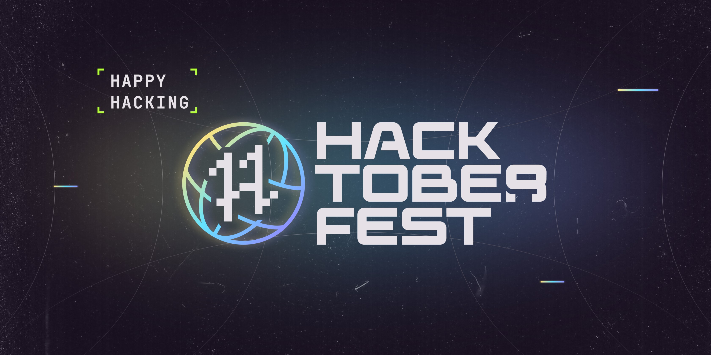

<p align="center">
  
</p>

# Hacktoberfest 2022 Swag List

[](https://awesome.re)

Hacktoberfest is digitalocean’s annual event that encourages people to contribute to open source throughout october. Much of modern tech infrastructure—including some of digitalocean’s own products—relies on open-source projects built and maintained by passionate people who often don’t have the staff or budgets to do much more than keep the project alive. Hacktoberfest is all about giving back to those projects, sharpening skills, and celebrating all things open source, especially the people that make open source so special.

## 🚀 View Live Demo

<pre><a href="https://hacktoberfestswag.vercel.app"><b>hacktoberfestswag.vercel.app</b></a></pre>

## 👨‍💻 Tech Stack


## 🛠️ Installation Steps

Star and Fork the Repo 🌟 and this will keep us motivated.

Clone the repository

```bash
git clone https://github.com/swapnilsparsh/hacktoberfest-swag.git
```

Change the working directory

```bash
cd hacktoberfest-swag
```

Install dependencies

```bash
npm install
```

Run the app

```bash
npm run dev
```
